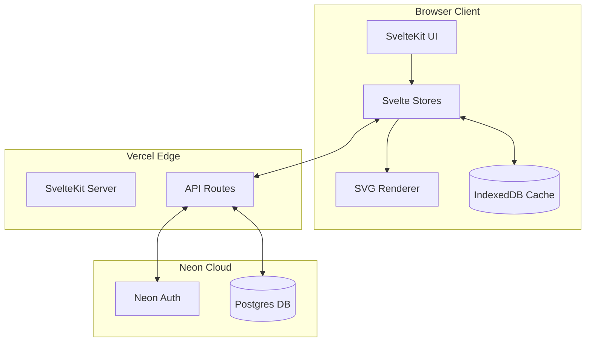
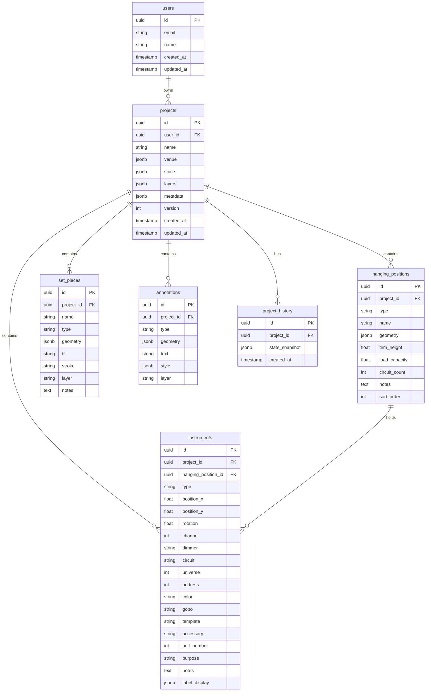
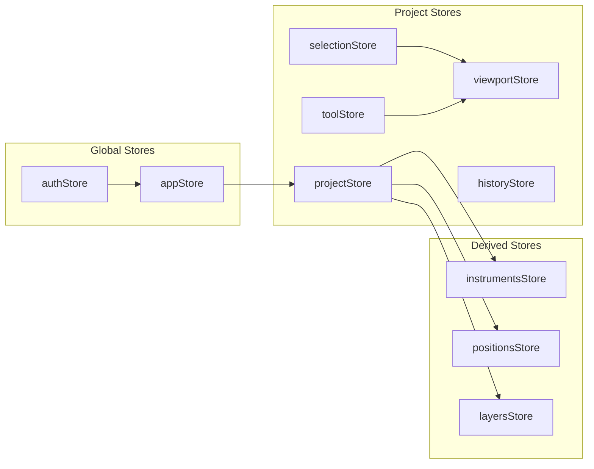
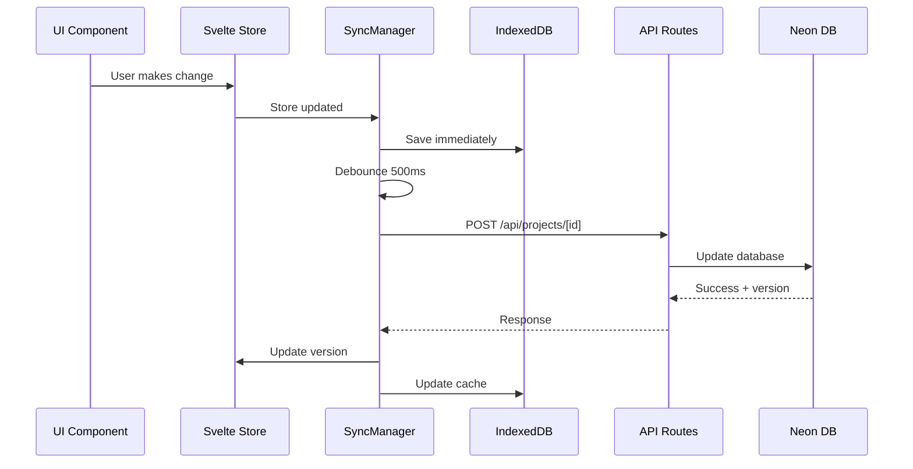
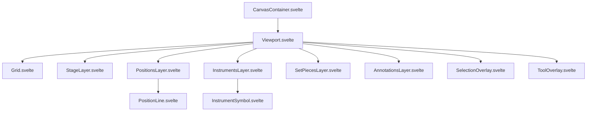
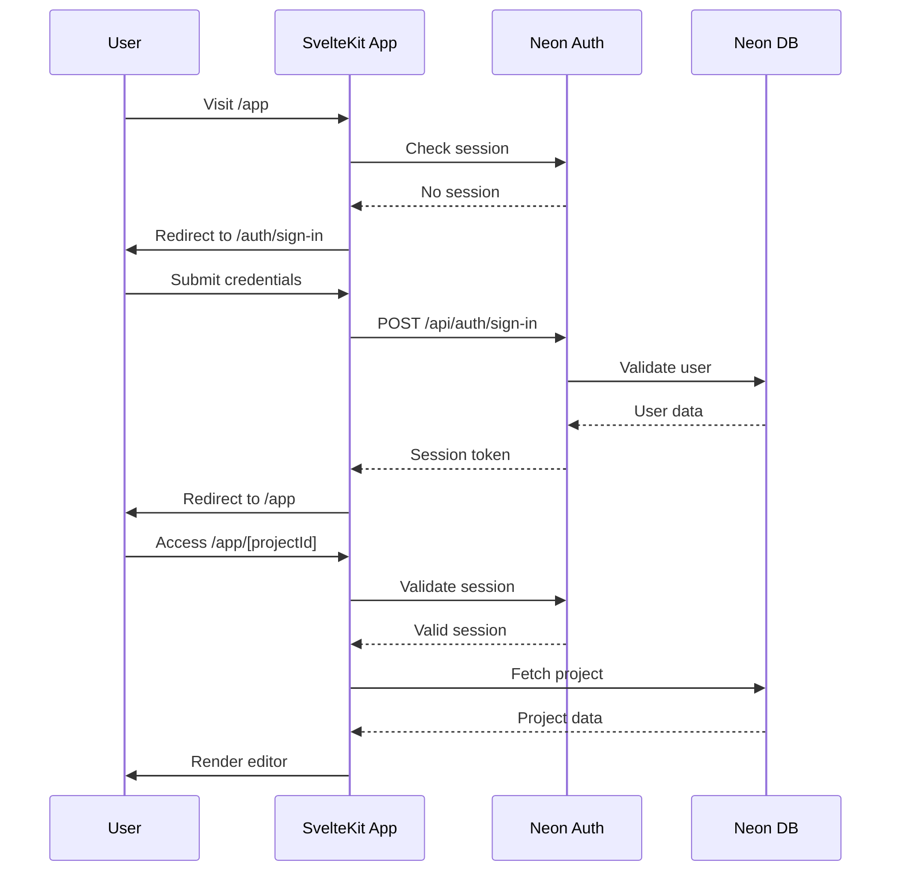

# LightsLite Architecture Documentation

## Overview

LightsLite is a browser-based 2D CAD application for theatrical lighting designers. This documentation is split into focused sections for easier consumption.

## Quick Reference

| Decision       | Choice               | Rationale                                        |
| -------------- | -------------------- | ------------------------------------------------ |
| Cloud Sync     | Required for v1      | Multi-device access needed                       |
| Sync Strategy  | Server-authoritative | Simpler implementation, users mostly online      |
| Rendering      | SVG                  | Development simplicity, optimize later if needed |
| Authentication | Neon Auth            | Integrated with database, simpler stack          |
| Deployment     | Vercel               | Excellent SvelteKit support                      |
| Data Model     | Hybrid               | Normalized entities + JSON for complex data      |

## System Architecture Overview

### Architecture Diagram



### Data Flow

1. **User Action** → Svelte Store updated → SVG re-renders
2. **Store Change** → Debounced save to IndexedDB (immediate) + API (500ms)
3. **API Response** → Store updated → IndexedDB synced
4. **Page Load** → Check IndexedDB for cached data → Fetch from API → Merge

## Technology Stack

### Frontend

| Technology   | Purpose           | Version |
| ------------ | ----------------- | ------- |
| SvelteKit    | Framework         | 2.x     |
| Svelte 5     | UI Components     | 5.x     |
| TypeScript   | Type Safety       | 5.x     |
| SVG          | Rendering         | Native  |
| Tailwind CSS | Styling           | 4.x     |
| idb          | IndexedDB wrapper | 8.x     |

### Backend

| Technology               | Purpose          | Version |
| ------------------------ | ---------------- | ------- |
| SvelteKit API Routes     | REST API         | -       |
| Drizzle ORM              | Database queries | Latest  |
| @neondatabase/serverless | DB connection    | Latest  |
| @neondatabase/auth       | Authentication   | Latest  |
| Zod                      | Validation       | 4.x     |

### Infrastructure

| Service   | Purpose                  |
| --------- | ------------------------ |
| Vercel    | Hosting & Edge Functions |
| Neon      | Postgres Database        |
| Neon Auth | User Authentication      |

## Database Schema Design

### Entity Relationship Diagram



## State Management Architecture

### Store Structure



## Data Synchronization Layer

### Sync Architecture



## SVG Rendering Architecture

### Component Hierarchy



## API Routes Structure

### Route Map

| Method | Route                               | Description               |
| ------ | ----------------------------------- | ------------------------- |
| GET    | `/api/projects`                     | List user's projects      |
| POST   | `/api/projects`                     | Create new project        |
| GET    | `/api/projects/[id]`                | Get project with all data |
| PUT    | `/api/projects/[id]`                | Update project            |
| DELETE | `/api/projects/[id]`                | Delete project            |
| POST   | `/api/projects/[id]/duplicate`      | Duplicate project         |
| GET    | `/api/projects/[id]/export`         | Export as JSON            |
| GET    | `/api/projects/[id]/reports/[type]` | Generate report           |

## File Structure

```
lightslite/
├── src/
│   ├── lib/
│   │   ├── components/
│   │   │   ├── canvas/
│   │   │   │   ├── Viewport.svelte
│   │   │   │   ├── Grid.svelte
│   │   │   │   ├── layers/
│   │   │   │   │   ├── StageLayer.svelte
│   │   │   │   │   ├── PositionsLayer.svelte
│   │   │   │   │   ├── InstrumentsLayer.svelte
│   │   │   │   │   ├── SetPiecesLayer.svelte
│   │   │   │   │   └── AnnotationsLayer.svelte
│   │   │   │   ├── overlays/
│   │   │   │   │   ├── SelectionOverlay.svelte
│   │   │   │   │   └── ToolOverlay.svelte
│   │   │   │   └── symbols/
│   │   │   │       ├── InstrumentSymbol.svelte
│   │   │   │       ├── PositionLine.svelte
│   │   │   │       └── index.ts
│   │   │   ├── ui/
│   │   │   │   ├── MenuBar.svelte
│   │   │   │   ├── ToolPalette.svelte
│   │   │   │   ├── PropertiesPanel.svelte
│   │   │   │   ├── StatusBar.svelte
│   │   │   │   └── dialogs/
│   │   │   │       ├── NewProjectDialog.svelte
│   │   │   │       ├── ExportDialog.svelte
│   │   │   │       └── SettingsDialog.svelte
│   │   │   └── reports/
│   │   │       ├── ChannelHookup.svelte
│   │   │       ├── InstrumentSchedule.svelte
│   │   │       └── DimmerSchedule.svelte
│   │   ├── db/
│   │   │   ├── index.ts          # Drizzle client
│   │   │   ├── schema.ts         # Database schema
│   │   │   └── migrations/       # Drizzle migrations
│   │   ├── stores/
│   │   │   ├── project.ts        # Project state
│   │   │   ├── selection.ts      # Selection state
│   │   │   ├── viewport.ts       # Pan/zoom state
│   │   │   ├── tool.ts           # Active tool
│   │   │   ├── history.ts        # Undo/redo
│   │   │   └── index.ts          # Re-exports
│   │   ├── sync/
│   │   │   ├── manager.ts        # Sync orchestration
│   │   │   ├── indexeddb.ts      # Local storage
│   │   │   └── conflict.ts       # Conflict resolution
│   │   ├── symbols/
│   │   │   ├── paths.ts          # SVG path definitions
│   │   │   ├── types.ts          # Symbol type mappings
│   │   │   └── index.ts
│   │   ├── reports/
│   │   │   ├── generators/
│   │   │   │   ├── channel-hookup.ts
│   │   │   │   ├── instrument-schedule.ts
│   │   │   │   └── dimmer-schedule.ts
│   │   │   ├── pdf.ts            # PDF generation
│   │   │   └── csv.ts            # CSV export
│   │   ├── types/
│   │   │   ├── project.ts
│   │   │   ├── instrument.ts
│   │   │   ├── geometry.ts
│   │   │   └── index.ts
│   │   ├── utils/
│   │   │   ├── geometry.ts       # Geometry calculations
│   │   │   ├── snap.ts           # Snapping logic
│   │   │   ├── keyboard.ts       # Keyboard shortcuts
│   │   │   └── debounce.ts
│   │   └── auth/
│   │       └── client.ts         # Neon Auth client
│   ├── routes/
│   │   ├── +layout.svelte
│   │   ├── +layout.server.ts     # Auth check
│   │   ├── +page.svelte          # Landing/dashboard
│   │   ├── auth/
│   │   │   └── [...path]/
│   │   │       └── +page.svelte  # Auth pages
│   │   ├── app/
│   │   │   ├── +layout.svelte    # App shell
│   │   │   ├── +page.svelte      # Project list
│   │   │   └── [projectId]/
│   │   │       ├── +page.svelte  # Editor
│   │   │       └── +page.ts      # Load project
│   │   └── api/
│   │       ├── auth/
│   │       │   └── [...path]/
│   │       │       └── +server.ts
│   │       └── projects/
│   │           ├── +server.ts
│   │           └── [id]/
│   │               ├── +server.ts
│   │               ├── duplicate/
│   │               │   └── +server.ts
│   │               ├── export/
│   │               │   └── +server.ts
│   │               └── reports/
│   │                   └── [type]/
│   │                       └── +server.ts
│   └── app.html
├── static/
│   └── symbols/                  # SVG symbol files
├── drizzle/
│   └── migrations/               # SQL migrations
├── drizzle.config.ts
├── svelte.config.js
├── vite.config.ts
├── tailwind.config.js
├── package.json
└── .env.example
```

## Authentication Flow

### Sequence Diagram



## Keyboard Shortcuts System

### Shortcut Reference

| Category | Shortcut           | Action         |
| -------- | ------------------ | -------------- |
| Tools    | `V`                | Select tool    |
| Tools    | `H`                | Pan tool       |
| Tools    | `I`                | Add instrument |
| Tools    | `E`                | Add electric   |
| Edit     | `Ctrl+Z`           | Undo           |
| Edit     | `Ctrl+Shift+Z`     | Redo           |
| Edit     | `Ctrl+D`           | Duplicate      |
| Edit     | `Ctrl+A`           | Select all     |
| Edit     | `Delete/Backspace` | Delete         |
| View     | `Ctrl+0`           | Fit all        |
| View     | `Ctrl+=`           | Zoom in        |
| View     | `Ctrl+-`           | Zoom out       |
| File     | `Ctrl+S`           | Save           |
| File     | `Ctrl+Shift+E`     | Export         |

## Report Generation

### Report Generation System

- Generate reports from the current project
- Export to PDF or CSV
- Reports are generated on the server

### Available Reports

| Report Type         | Description                       | Export Formats |
| ------------------- | --------------------------------- | -------------- |
| Channel Hookup      | Channels with instrument details  | PDF, CSV       |
| Instrument Schedule | All instruments by position       | PDF, CSV       |
| Dimmer Schedule     | Dimmer assignments with load info | PDF, CSV       |

## Environment & Configuration

### Environment Variables

```bash
# .env.example

# Neon Database
DATABASE_URL="postgresql://[user]:[password]@[host]/[dbname]?sslmode=require"

# Neon Auth
NEON_AUTH_BASE_URL="https://ep-xxx.neonauth.c-2.us-east-2.aws.neon.build/dbname/auth"
PUBLIC_NEON_AUTH_URL="https://ep-xxx.neonauth.c-2.us-east-2.aws.neon.build/dbname/auth"

# App
PUBLIC_APP_URL="http://localhost:5173"
```

### Key Technical Decisions Summary

| Area          | Decision                | Rationale                          |
| ------------- | ----------------------- | ---------------------------------- |
| Framework     | SvelteKit 2 + Svelte 5  | Modern, performant, great DX       |
| Rendering     | SVG                     | Simpler development, native events |
| State         | Svelte stores           | Built-in reactivity, simple API    |
| Local Storage | IndexedDB via idb       | Structured data, good capacity     |
| Database      | Neon Postgres + Drizzle | Serverless, type-safe ORM          |
| Auth          | Neon Auth               | Integrated, simpler stack          |
| Sync          | Server-authoritative    | Simpler conflict resolution        |
| Deployment    | Vercel                  | Excellent SvelteKit support        |
| Styling       | Tailwind CSS            | Rapid development, consistent      |

## Implementation Phases

### Phase 1: Foundation

- [ ] Initialize SvelteKit project with TypeScript
- [ ] Set up Tailwind CSS
- [ ] Configure Vercel adapter
- [ ] Set up Neon database and Drizzle ORM
- [ ] Create database schema and run migrations
- [ ] Implement Neon Auth integration
- [ ] Create basic route structure

### Phase 2: Core Editor

- [ ] Implement SVG viewport with pan/zoom
- [ ] Create grid rendering
- [ ] Build selection system
- [ ] Implement basic shape drawing
- [ ] Create instrument symbol library
- [ ] Build properties panel

### Phase 3: Data Layer

- [ ] Implement Svelte stores for project state
- [ ] Build IndexedDB persistence layer
- [ ] Create SyncManager for server sync
- [ ] Implement undo/redo system
- [ ] Add version conflict handling

### Phase 4: Domain Features

- [ ] Implement hanging position tools
- [ ] Build instrument placement with snapping
- [ ] Create venue/stage configuration
- [ ] Add layer system
- [ ] Implement keyboard shortcuts

### Phase 5: Paperwork

- [ ] Build channel hookup report
- [ ] Create instrument schedule
- [ ] Implement dimmer schedule
- [ ] Add PDF export
- [ ] Add CSV export

### Phase 6: Polish

- [ ] Add project management (list, create, delete)
- [ ] Implement crash recovery
- [ ] Add offline indicator
- [ ] Performance optimization
- [ ] Testing and bug fixes

## Next Steps

1. Review this architecture plan
2. Approve or request changes
3. Switch to Code mode to begin implementation
4. Start with Phase 1: Foundation
