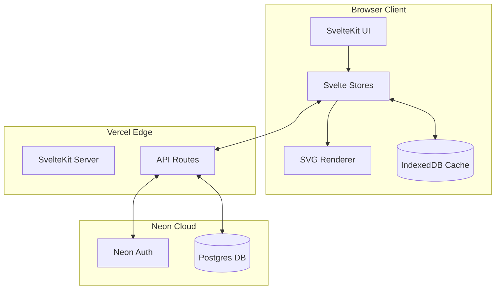
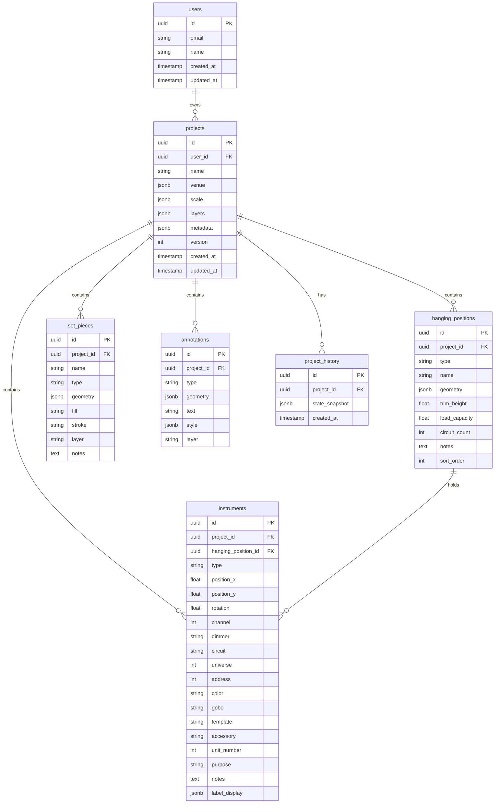
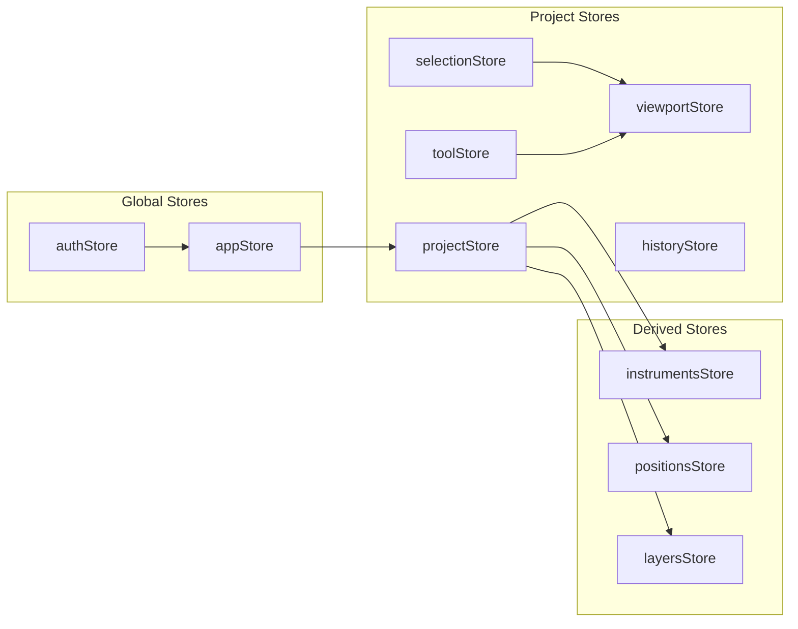
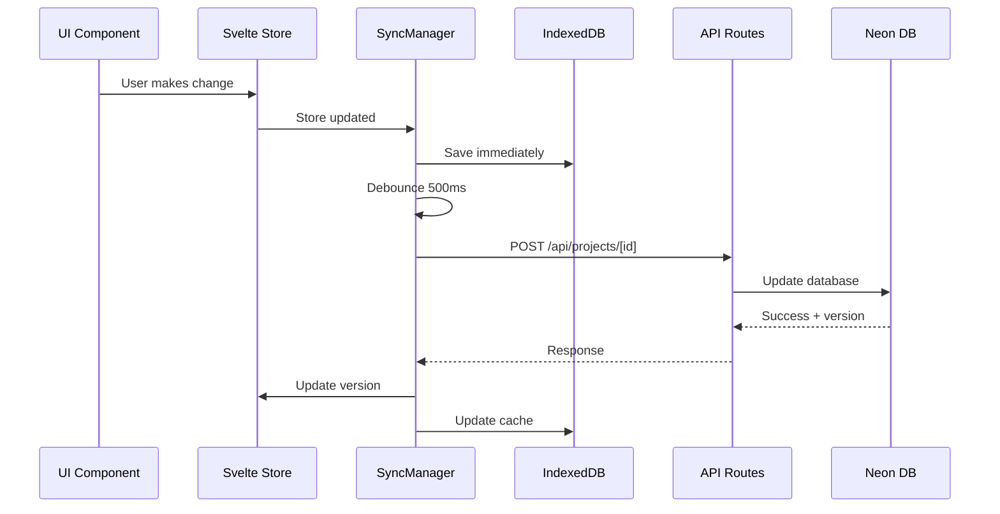
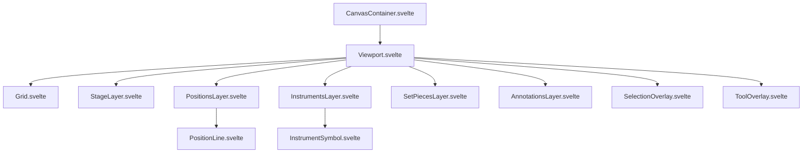
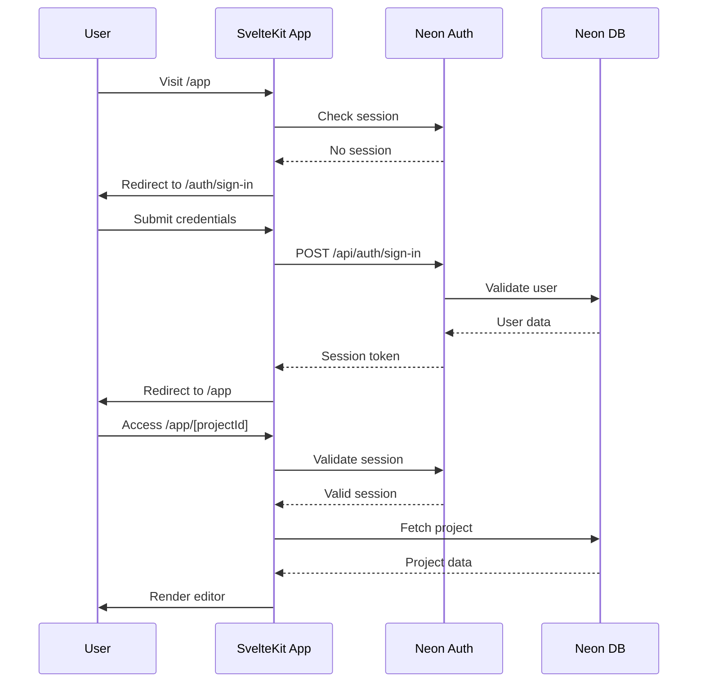

# LightsLite - Detailed Architecture Plan

## Executive Summary

LightsLite is a browser-based 2D CAD application for theatrical lighting designers. This document outlines the technical architecture based on the following key decisions:

| Decision       | Choice               | Rationale                                        |
| -------------- | -------------------- | ------------------------------------------------ |
| Cloud Sync     | Required for v1      | Multi-device access needed                       |
| Sync Strategy  | Server-authoritative | Simpler implementation, users mostly online      |
| Rendering      | SVG                  | Development simplicity, optimize later if needed |
| Authentication | Neon Auth            | Integrated with database, simpler stack          |
| Deployment     | Vercel               | Excellent SvelteKit support                      |
| Data Model     | Hybrid               | Normalized entities + JSON for complex data      |

---

## 1. System Architecture Overview



### Data Flow

1. **User Action** → Svelte Store updated → SVG re-renders
2. **Store Change** → Debounced save to IndexedDB (immediate) + API (500ms)
3. **API Response** → Store updated → IndexedDB synced
4. **Page Load** → Check IndexedDB for cached data → Fetch from API → Merge

---

## 2. Technology Stack

### Frontend

| Technology   | Purpose           | Version |
| ------------ | ----------------- | ------- |
| SvelteKit    | Framework         | 2.x     |
| Svelte 5     | UI Components     | 5.x     |
| TypeScript   | Type Safety       | 5.x     |
| SVG          | Rendering         | Native  |
| Tailwind CSS | Styling           | 4.x     |
| idb          | IndexedDB wrapper | 8.x     |

### Backend

| Technology               | Purpose          | Version |
| ------------------------ | ---------------- | ------- |
| SvelteKit API Routes     | REST API         | -       |
| Drizzle ORM              | Database queries | Latest  |
| @neondatabase/serverless | DB connection    | Latest  |
| @neondatabase/auth       | Authentication   | Latest  |
| Zod                      | Validation       | 4.x     |

### Infrastructure

| Service   | Purpose                  |
| --------- | ------------------------ |
| Vercel    | Hosting & Edge Functions |
| Neon      | Postgres Database        |
| Neon Auth | User Authentication      |

---

## 3. Database Schema Design

### Entity Relationship Diagram



### Drizzle Schema Definition

```typescript
// src/lib/db/schema.ts

import {
  pgTable,
  uuid,
  text,
  timestamp,
  jsonb,
  integer,
  real,
  index,
} from "drizzle-orm/pg-core";
import { relations } from "drizzle-orm";

// Users table - managed by Neon Auth but we reference it
export const users = pgTable("users", {
  id: uuid("id").primaryKey().defaultRandom(),
  email: text("email").notNull().unique(),
  name: text("name"),
  createdAt: timestamp("created_at").defaultNow().notNull(),
  updatedAt: timestamp("updated_at").defaultNow().notNull(),
});

export const projects = pgTable(
  "projects",
  {
    id: uuid("id").primaryKey().defaultRandom(),
    userId: uuid("user_id")
      .notNull()
      .references(() => users.id, { onDelete: "cascade" }),
    name: text("name").notNull(),
    venue: jsonb("venue").$type<VenueData>(),
    scale: jsonb("scale").$type<ScaleData>(),
    layers: jsonb("layers").$type<LayerData[]>(),
    metadata: jsonb("metadata").$type<ProjectMetadata>(),
    version: integer("version").notNull().default(1),
    createdAt: timestamp("created_at").defaultNow().notNull(),
    updatedAt: timestamp("updated_at").defaultNow().notNull(),
  },
  (table) => ({
    userIdIdx: index("projects_user_id_idx").on(table.userId),
  })
);

export const hangingPositions = pgTable(
  "hanging_positions",
  {
    id: uuid("id").primaryKey().defaultRandom(),
    projectId: uuid("project_id")
      .notNull()
      .references(() => projects.id, { onDelete: "cascade" }),
    type: text("type").notNull(), // electric, truss, ladder, boom, etc.
    name: text("name").notNull(),
    geometry: jsonb("geometry").$type<LineGeometry | RectGeometry>().notNull(),
    trimHeight: real("trim_height"),
    loadCapacity: real("load_capacity"),
    circuitCount: integer("circuit_count"),
    notes: text("notes"),
    sortOrder: integer("sort_order").notNull().default(0),
  },
  (table) => ({
    projectIdIdx: index("hanging_positions_project_id_idx").on(table.projectId),
  })
);

export const instruments = pgTable(
  "instruments",
  {
    id: uuid("id").primaryKey().defaultRandom(),
    projectId: uuid("project_id")
      .notNull()
      .references(() => projects.id, { onDelete: "cascade" }),
    hangingPositionId: uuid("hanging_position_id").references(
      () => hangingPositions.id,
      { onDelete: "set null" }
    ),
    type: text("type").notNull(),
    positionX: real("position_x").notNull(),
    positionY: real("position_y").notNull(),
    rotation: real("rotation").notNull().default(0),
    channel: integer("channel"),
    dimmer: text("dimmer"),
    circuit: text("circuit"),
    universe: integer("universe"),
    address: integer("address"),
    color: text("color"),
    gobo: text("gobo"),
    template: text("template"),
    accessory: text("accessory"),
    unitNumber: integer("unit_number"),
    purpose: text("purpose"),
    notes: text("notes"),
    labelDisplay: jsonb("label_display").$type<LabelConfig>(),
  },
  (table) => ({
    projectIdIdx: index("instruments_project_id_idx").on(table.projectId),
    channelIdx: index("instruments_channel_idx").on(table.channel),
    hangingPositionIdx: index("instruments_hanging_position_idx").on(
      table.hangingPositionId
    ),
  })
);

export const setPieces = pgTable(
  "set_pieces",
  {
    id: uuid("id").primaryKey().defaultRandom(),
    projectId: uuid("project_id")
      .notNull()
      .references(() => projects.id, { onDelete: "cascade" }),
    name: text("name").notNull(),
    type: text("type").notNull(),
    geometry: jsonb("geometry").$type<Shape>().notNull(),
    fill: text("fill"),
    stroke: text("stroke"),
    layer: text("layer"),
    notes: text("notes"),
  },
  (table) => ({
    projectIdIdx: index("set_pieces_project_id_idx").on(table.projectId),
  })
);

export const annotations = pgTable(
  "annotations",
  {
    id: uuid("id").primaryKey().defaultRandom(),
    projectId: uuid("project_id")
      .notNull()
      .references(() => projects.id, { onDelete: "cascade" }),
    type: text("type").notNull(),
    geometry: jsonb("geometry").$type<Shape>().notNull(),
    text: text("text"),
    style: jsonb("style").$type<AnnotationStyle>(),
    layer: text("layer"),
  },
  (table) => ({
    projectIdIdx: index("annotations_project_id_idx").on(table.projectId),
  })
);

export const projectHistory = pgTable(
  "project_history",
  {
    id: uuid("id").primaryKey().defaultRandom(),
    projectId: uuid("project_id")
      .notNull()
      .references(() => projects.id, { onDelete: "cascade" }),
    stateSnapshot: jsonb("state_snapshot").notNull(),
    createdAt: timestamp("created_at").defaultNow().notNull(),
  },
  (table) => ({
    projectIdIdx: index("project_history_project_id_idx").on(table.projectId),
    createdAtIdx: index("project_history_created_at_idx").on(table.createdAt),
  })
);

// Relations
export const projectsRelations = relations(projects, ({ one, many }) => ({
  user: one(users, { fields: [projects.userId], references: [users.id] }),
  hangingPositions: many(hangingPositions),
  instruments: many(instruments),
  setPieces: many(setPieces),
  annotations: many(annotations),
  history: many(projectHistory),
}));

export const hangingPositionsRelations = relations(
  hangingPositions,
  ({ one, many }) => ({
    project: one(projects, {
      fields: [hangingPositions.projectId],
      references: [projects.id],
    }),
    instruments: many(instruments),
  })
);

export const instrumentsRelations = relations(instruments, ({ one }) => ({
  project: one(projects, {
    fields: [instruments.projectId],
    references: [projects.id],
  }),
  hangingPosition: one(hangingPositions, {
    fields: [instruments.hangingPositionId],
    references: [hangingPositions.id],
  }),
}));
```

---

## 4. State Management Architecture

### Store Structure



### Store Definitions

```typescript
// src/lib/stores/project.ts

import { writable, derived } from "svelte/store";
import type {
  Project,
  Instrument,
  HangingPosition,
  SetPiece,
  Annotation,
} from "$lib/types";

// Main project store
function createProjectStore() {
  const { subscribe, set, update } = writable<Project | null>(null);

  return {
    subscribe,
    set,
    update,

    // Instrument operations
    addInstrument: (instrument: Omit<Instrument, "id">) => {
      update((project) => {
        if (!project) return project;
        const newInstrument = { ...instrument, id: crypto.randomUUID() };
        return {
          ...project,
          instruments: [...project.instruments, newInstrument],
          modified: new Date(),
        };
      });
    },

    updateInstrument: (id: string, changes: Partial<Instrument>) => {
      update((project) => {
        if (!project) return project;
        return {
          ...project,
          instruments: project.instruments.map((i) =>
            i.id === id ? { ...i, ...changes } : i
          ),
          modified: new Date(),
        };
      });
    },

    deleteInstruments: (ids: string[]) => {
      update((project) => {
        if (!project) return project;
        return {
          ...project,
          instruments: project.instruments.filter((i) => !ids.includes(i.id)),
          modified: new Date(),
        };
      });
    },

    // Similar methods for hanging positions, set pieces, annotations...
  };
}

export const projectStore = createProjectStore();

// Derived stores for efficient access
export const instrumentsStore = derived(
  projectStore,
  ($project) => $project?.instruments ?? []
);

export const hangingPositionsStore = derived(
  projectStore,
  ($project) => $project?.hangingPositions ?? []
);

export const instrumentsByPosition = derived(
  [instrumentsStore, hangingPositionsStore],
  ([$instruments, $positions]) => {
    const map = new Map<string, Instrument[]>();
    for (const pos of $positions) {
      map.set(
        pos.id,
        $instruments.filter((i) => i.hangingPositionId === pos.id)
      );
    }
    return map;
  }
);

// Selection store
export const selectionStore = writable<Set<string>>(new Set());

// Viewport store
export const viewportStore = writable({
  pan: { x: 0, y: 0 },
  zoom: 1,
  width: 0,
  height: 0,
});

// Tool store
export type Tool =
  | "select"
  | "pan"
  | "line"
  | "rect"
  | "circle"
  | "electric"
  | "instrument";
export const toolStore = writable<Tool>("select");

// History store for undo/redo
function createHistoryStore() {
  const { subscribe, set, update } = writable<{
    past: Project[];
    future: Project[];
  }>({ past: [], future: [] });

  return {
    subscribe,

    push: (state: Project) => {
      update((h) => ({
        past: [...h.past.slice(-49), state], // Keep last 50 states
        future: [],
      }));
    },

    undo: () => {
      let previousState: Project | undefined;
      update((h) => {
        if (h.past.length === 0) return h;
        previousState = h.past[h.past.length - 1];
        return {
          past: h.past.slice(0, -1),
          future: [previousState!, ...h.future],
        };
      });
      return previousState;
    },

    redo: () => {
      let nextState: Project | undefined;
      update((h) => {
        if (h.future.length === 0) return h;
        nextState = h.future[0];
        return {
          past: [...h.past, nextState!],
          future: h.future.slice(1),
        };
      });
      return nextState;
    },

    clear: () => set({ past: [], future: [] }),
  };
}

export const historyStore = createHistoryStore();
```

---

## 5. Data Synchronization Layer

### Sync Architecture



### SyncManager Implementation

```typescript
// src/lib/sync/manager.ts

import { openDB, type IDBPDatabase } from "idb";
import { projectStore } from "$lib/stores/project";
import type { Project } from "$lib/types";

interface SyncState {
  status: "idle" | "syncing" | "error" | "offline";
  lastSynced: Date | null;
  pendingChanges: boolean;
  error: string | null;
}

class SyncManager {
  private db: IDBPDatabase | null = null;
  private debounceTimer: ReturnType<typeof setTimeout> | null = null;
  private syncState = writable<SyncState>({
    status: "idle",
    lastSynced: null,
    pendingChanges: false,
    error: null,
  });

  async init() {
    this.db = await openDB("lightslite", 1, {
      upgrade(db) {
        // Projects cache
        db.createObjectStore("projects", { keyPath: "id" });
        // Offline queue for failed syncs
        db.createObjectStore("syncQueue", {
          keyPath: "id",
          autoIncrement: true,
        });
        // App state
        db.createObjectStore("appState", { keyPath: "key" });
      },
    });

    // Subscribe to project changes
    projectStore.subscribe(this.handleProjectChange.bind(this));

    // Process any queued changes from previous session
    await this.processQueue();
  }

  private async handleProjectChange(project: Project | null) {
    if (!project) return;

    // Save to IndexedDB immediately
    await this.saveToLocal(project);

    // Debounce API sync
    if (this.debounceTimer) {
      clearTimeout(this.debounceTimer);
    }

    this.syncState.update((s) => ({ ...s, pendingChanges: true }));

    this.debounceTimer = setTimeout(() => {
      this.syncToServer(project);
    }, 500);
  }

  private async saveToLocal(project: Project) {
    if (!this.db) return;
    await this.db.put("projects", project);
  }

  private async syncToServer(project: Project) {
    this.syncState.update((s) => ({ ...s, status: "syncing" }));

    try {
      const response = await fetch(`/api/projects/${project.id}`, {
        method: "PUT",
        headers: { "Content-Type": "application/json" },
        body: JSON.stringify(project),
      });

      if (!response.ok) {
        throw new Error(`Sync failed: ${response.statusText}`);
      }

      const { version } = await response.json();

      // Update local version
      projectStore.update((p) => (p ? { ...p, version } : p));

      this.syncState.update((s) => ({
        ...s,
        status: "idle",
        lastSynced: new Date(),
        pendingChanges: false,
        error: null,
      }));
    } catch (error) {
      // Queue for retry if offline
      if (!navigator.onLine) {
        await this.queueForSync(project);
        this.syncState.update((s) => ({ ...s, status: "offline" }));
      } else {
        this.syncState.update((s) => ({
          ...s,
          status: "error",
          error: error instanceof Error ? error.message : "Unknown error",
        }));
      }
    }
  }

  private async queueForSync(project: Project) {
    if (!this.db) return;
    await this.db.add("syncQueue", {
      projectId: project.id,
      data: project,
      timestamp: new Date(),
    });
  }

  private async processQueue() {
    if (!this.db || !navigator.onLine) return;

    const queue = await this.db.getAll("syncQueue");
    for (const item of queue) {
      try {
        await this.syncToServer(item.data);
        await this.db.delete("syncQueue", item.id);
      } catch {
        // Will retry on next online event
        break;
      }
    }
  }

  async loadProject(id: string): Promise<Project | null> {
    // Try local cache first
    if (this.db) {
      const cached = await this.db.get("projects", id);
      if (cached) {
        projectStore.set(cached);
      }
    }

    // Fetch from server
    try {
      const response = await fetch(`/api/projects/${id}`);
      if (!response.ok) throw new Error("Failed to load project");

      const project = await response.json();
      projectStore.set(project);
      await this.saveToLocal(project);

      return project;
    } catch (error) {
      // Return cached version if available
      if (this.db) {
        return await this.db.get("projects", id);
      }
      throw error;
    }
  }

  get state() {
    return { subscribe: this.syncState.subscribe };
  }
}

export const syncManager = new SyncManager();
```

---

## 6. SVG Rendering Architecture

### Component Hierarchy



### SVG Viewport Component

```svelte
<!-- src/lib/components/canvas/Viewport.svelte -->
<script lang="ts">
  import { viewportStore, toolStore, selectionStore } from '$lib/stores';
  import Grid from './Grid.svelte';
  import StageLayer from './layers/StageLayer.svelte';
  import PositionsLayer from './layers/PositionsLayer.svelte';
  import InstrumentsLayer from './layers/InstrumentsLayer.svelte';
  import SelectionOverlay from './overlays/SelectionOverlay.svelte';

  let svgElement: SVGSVGElement;
  let isPanning = false;
  let panStart = { x: 0, y: 0 };

  $: transform = `translate(${$viewportStore.pan.x}, ${$viewportStore.pan.y}) scale(${$viewportStore.zoom})`;

  function handleWheel(e: WheelEvent) {
    e.preventDefault();
    const delta = e.deltaY > 0 ? 0.9 : 1.1;
    const rect = svgElement.getBoundingClientRect();
    const x = e.clientX - rect.left;
    const y = e.clientY - rect.top;

    viewportStore.update(v => {
      const newZoom = Math.max(0.1, Math.min(5, v.zoom * delta));
      // Zoom toward cursor position
      const zoomRatio = newZoom / v.zoom;
      return {
        ...v,
        zoom: newZoom,
        pan: {
          x: x - (x - v.pan.x) * zoomRatio,
          y: y - (y - v.pan.y) * zoomRatio,
        },
      };
    });
  }

  function handleMouseDown(e: MouseEvent) {
    if ($toolStore === 'pan' || e.button === 1 || (e.button === 0 && e.shiftKey)) {
      isPanning = true;
      panStart = { x: e.clientX - $viewportStore.pan.x, y: e.clientY - $viewportStore.pan.y };
    }
  }

  function handleMouseMove(e: MouseEvent) {
    if (isPanning) {
      viewportStore.update(v => ({
        ...v,
        pan: { x: e.clientX - panStart.x, y: e.clientY - panStart.y },
      }));
    }
  }

  function handleMouseUp() {
    isPanning = false;
  }
</script>

<svg
  bind:this={svgElement}
  class="w-full h-full bg-gray-900"
  on:wheel={handleWheel}
  on:mousedown={handleMouseDown}
  on:mousemove={handleMouseMove}
  on:mouseup={handleMouseUp}
  on:mouseleave={handleMouseUp}
>
  <g {transform}>
    <Grid />
    <StageLayer />
    <PositionsLayer />
    <InstrumentsLayer />
    <SelectionOverlay />
  </g>
</svg>
```

### Instrument Symbol Component

```svelte
<!-- src/lib/components/canvas/symbols/InstrumentSymbol.svelte -->
<script lang="ts">
  import type { Instrument } from '$lib/types';
  import { selectionStore } from '$lib/stores';
  import { getSymbolPath } from '$lib/symbols';

  export let instrument: Instrument;
  export let scale: number = 1;

  $: isSelected = $selectionStore.has(instrument.id);
  $: symbolPath = getSymbolPath(instrument.type);
  $: transform = `translate(${instrument.position.x}, ${instrument.position.y}) rotate(${instrument.rotation})`;

  function handleClick(e: MouseEvent) {
    e.stopPropagation();
    if (e.shiftKey) {
      selectionStore.update(s => {
        const newSet = new Set(s);
        if (newSet.has(instrument.id)) {
          newSet.delete(instrument.id);
        } else {
          newSet.add(instrument.id);
        }
        return newSet;
      });
    } else {
      selectionStore.set(new Set([instrument.id]));
    }
  }
</script>

<g
  {transform}
  class="instrument cursor-pointer"
  class:selected={isSelected}
  on:click={handleClick}
  role="button"
  tabindex="0"
>
  <!-- Symbol shape -->
  <path
    d={symbolPath}
    fill={instrument.color ? `var(--color-${instrument.color})` : 'white'}
    stroke={isSelected ? '#3b82f6' : '#666'}
    stroke-width={isSelected ? 2 : 1}
  />

  <!-- Channel label -->
  {#if instrument.channel && instrument.labelDisplay?.showChannel}
    <text
      y="-20"
      text-anchor="middle"
      class="text-xs fill-white"
    >
      {instrument.channel}
    </text>
  {/if}

  <!-- Selection indicator -->
  {#if isSelected}
    <circle r="4" cx="0" cy="0" fill="#3b82f6" />
  {/if}
</g>

<style>
  .instrument:hover path {
    stroke: #60a5fa;
  }

  .selected path {
    filter: drop-shadow(0 0 4px rgba(59, 130, 246, 0.5));
  }
</style>
```

---

## 7. API Routes Structure

### Route Map

| Method | Route                               | Description               |
| ------ | ----------------------------------- | ------------------------- |
| GET    | `/api/projects`                     | List user's projects      |
| POST   | `/api/projects`                     | Create new project        |
| GET    | `/api/projects/[id]`                | Get project with all data |
| PUT    | `/api/projects/[id]`                | Update project            |
| DELETE | `/api/projects/[id]`                | Delete project            |
| POST   | `/api/projects/[id]/duplicate`      | Duplicate project         |
| GET    | `/api/projects/[id]/export`         | Export as JSON            |
| GET    | `/api/projects/[id]/reports/[type]` | Generate report           |

### API Route Implementation

```typescript
// src/routes/api/projects/[id]/+server.ts

import { json, error } from "@sveltejs/kit";
import type { RequestHandler } from "./$types";
import { db } from "$lib/db";
import {
  projects,
  instruments,
  hangingPositions,
  setPieces,
  annotations,
} from "$lib/db/schema";
import { eq, and } from "drizzle-orm";
import { z } from "zod";

const updateProjectSchema = z.object({
  name: z.string().optional(),
  venue: z.any().optional(),
  scale: z.any().optional(),
  layers: z.array(z.any()).optional(),
  metadata: z.any().optional(),
  instruments: z.array(z.any()).optional(),
  hangingPositions: z.array(z.any()).optional(),
  setPieces: z.array(z.any()).optional(),
  annotations: z.array(z.any()).optional(),
  version: z.number(),
});

export const GET: RequestHandler = async ({ params, locals }) => {
  const session = await locals.auth.getSession();
  if (!session) throw error(401, "Unauthorized");

  const projectId = params.id;

  // Fetch project with all related data
  const project = await db.query.projects.findFirst({
    where: and(
      eq(projects.id, projectId),
      eq(projects.userId, session.user.id)
    ),
    with: {
      instruments: true,
      hangingPositions: true,
      setPieces: true,
      annotations: true,
    },
  });

  if (!project) throw error(404, "Project not found");

  return json(project);
};

export const PUT: RequestHandler = async ({ params, request, locals }) => {
  const session = await locals.auth.getSession();
  if (!session) throw error(401, "Unauthorized");

  const projectId = params.id;
  const body = await request.json();

  // Validate input
  const data = updateProjectSchema.parse(body);

  // Check ownership and version
  const existing = await db.query.projects.findFirst({
    where: and(
      eq(projects.id, projectId),
      eq(projects.userId, session.user.id)
    ),
  });

  if (!existing) throw error(404, "Project not found");

  // Optimistic locking - check version
  if (existing.version !== data.version) {
    throw error(409, "Version conflict - project was modified elsewhere");
  }

  // Update in transaction
  const newVersion = existing.version + 1;

  await db.transaction(async (tx) => {
    // Update project metadata
    await tx
      .update(projects)
      .set({
        name: data.name ?? existing.name,
        venue: data.venue ?? existing.venue,
        scale: data.scale ?? existing.scale,
        layers: data.layers ?? existing.layers,
        metadata: data.metadata ?? existing.metadata,
        version: newVersion,
        updatedAt: new Date(),
      })
      .where(eq(projects.id, projectId));

    // Sync instruments (delete removed, upsert existing/new)
    if (data.instruments) {
      await tx.delete(instruments).where(eq(instruments.projectId, projectId));
      if (data.instruments.length > 0) {
        await tx
          .insert(instruments)
          .values(data.instruments.map((i) => ({ ...i, projectId })));
      }
    }

    // Similar for other entities...
  });

  return json({ version: newVersion });
};

export const DELETE: RequestHandler = async ({ params, locals }) => {
  const session = await locals.auth.getSession();
  if (!session) throw error(401, "Unauthorized");

  const projectId = params.id;

  // Verify ownership
  const project = await db.query.projects.findFirst({
    where: and(
      eq(projects.id, projectId),
      eq(projects.userId, session.user.id)
    ),
  });

  if (!project) throw error(404, "Project not found");

  // Cascade delete handled by foreign keys
  await db.delete(projects).where(eq(projects.id, projectId));

  return json({ success: true });
};
```

---

## 8. File Structure

```
lightslite/
├── src/
│   ├── lib/
│   │   ├── components/
│   │   │   ├── canvas/
│   │   │   │   ├── Viewport.svelte
│   │   │   │   ├── Grid.svelte
│   │   │   │   ├── layers/
│   │   │   │   │   ├── StageLayer.svelte
│   │   │   │   │   ├── PositionsLayer.svelte
│   │   │   │   │   ├── InstrumentsLayer.svelte
│   │   │   │   │   ├── SetPiecesLayer.svelte
│   │   │   │   │   └── AnnotationsLayer.svelte
│   │   │   │   ├── overlays/
│   │   │   │   │   ├── SelectionOverlay.svelte
│   │   │   │   │   └── ToolOverlay.svelte
│   │   │   │   └── symbols/
│   │   │   │       ├── InstrumentSymbol.svelte
│   │   │   │       ├── PositionLine.svelte
│   │   │   │       └── index.ts
│   │   │   ├── ui/
│   │   │   │   ├── MenuBar.svelte
│   │   │   │   ├── ToolPalette.svelte
│   │   │   │   ├── PropertiesPanel.svelte
│   │   │   │   ├── StatusBar.svelte
│   │   │   │   └── dialogs/
│   │   │   │       ├── NewProjectDialog.svelte
│   │   │   │       ├── ExportDialog.svelte
│   │   │   │       └── SettingsDialog.svelte
│   │   │   └── reports/
│   │   │       ├── ChannelHookup.svelte
│   │   │       ├── InstrumentSchedule.svelte
│   │   │       └── DimmerSchedule.svelte
│   │   ├── db/
│   │   │   ├── index.ts          # Drizzle client
│   │   │   ├── schema.ts         # Database schema
│   │   │   └── migrations/       # Drizzle migrations
│   │   ├── stores/
│   │   │   ├── project.ts        # Project state
│   │   │   ├── selection.ts      # Selection state
│   │   │   ├── viewport.ts       # Pan/zoom state
│   │   │   ├── tool.ts           # Active tool
│   │   │   ├── history.ts        # Undo/redo
│   │   │   └── index.ts          # Re-exports
│   │   ├── sync/
│   │   │   ├── manager.ts        # Sync orchestration
│   │   │   ├── indexeddb.ts      # Local storage
│   │   │   └── conflict.ts       # Conflict resolution
│   │   ├── symbols/
│   │   │   ├── paths.ts          # SVG path definitions
│   │   │   ├── types.ts          # Symbol type mappings
│   │   │   └── index.ts
│   │   ├── reports/
│   │   │   ├── generators/
│   │   │   │   ├── channel-hookup.ts
│   │   │   │   ├── instrument-schedule.ts
│   │   │   │   └── dimmer-schedule.ts
│   │   │   ├── pdf.ts            # PDF generation
│   │   │   └── csv.ts            # CSV export
│   │   ├── types/
│   │   │   ├── project.ts
│   │   │   ├── instrument.ts
│   │   │   ├── geometry.ts
│   │   │   └── index.ts
│   │   ├── utils/
│   │   │   ├── geometry.ts       # Geometry calculations
│   │   │   ├── snap.ts           # Snapping logic
│   │   │   ├── keyboard.ts       # Keyboard shortcuts
│   │   │   └── debounce.ts
│   │   └── auth/
│   │       └── client.ts         # Neon Auth client
│   ├── routes/
│   │   ├── +layout.svelte
│   │   ├── +layout.server.ts     # Auth check
│   │   ├── +page.svelte          # Landing/dashboard
│   │   ├── auth/
│   │   │   └── [...path]/
│   │   │       └── +page.svelte  # Auth pages
│   │   ├── app/
│   │   │   ├── +layout.svelte    # App shell
│   │   │   ├── +page.svelte      # Project list
│   │   │   └── [projectId]/
│   │   │       ├── +page.svelte  # Editor
│   │   │       └── +page.ts      # Load project
│   │   └── api/
│   │       ├── auth/
│   │       │   └── [...path]/
│   │       │       └── +server.ts
│   │       └── projects/
│   │           ├── +server.ts
│   │           └── [id]/
│   │               ├── +server.ts
│   │               ├── duplicate/
│   │               │   └── +server.ts
│   │               ├── export/
│   │               │   └── +server.ts
│   │               └── reports/
│   │                   └── [type]/
│   │                       └── +server.ts
│   └── app.html
├── static/
│   └── symbols/                  # SVG symbol files
├── drizzle/
│   └── migrations/               # SQL migrations
├── drizzle.config.ts
├── svelte.config.js
├── vite.config.ts
├── tailwind.config.js
├── package.json
└── .env.example
```

---

## 9. Authentication Flow



### Auth Setup

```typescript
// src/lib/auth/client.ts
import { createAuthClient } from "@neondatabase/auth/next";

export const authClient = createAuthClient();

// src/routes/api/auth/[...path]/+server.ts
import { authApiHandler } from "@neondatabase/auth/next";
export const { GET, POST } = authApiHandler();

// src/routes/+layout.server.ts
import type { LayoutServerLoad } from "./$types";

export const load: LayoutServerLoad = async ({ locals }) => {
  const session = await locals.auth.getSession();
  return { session };
};

// src/hooks.server.ts
import { createAuthClient } from "@neondatabase/auth";
import type { Handle } from "@sveltejs/kit";

export const handle: Handle = async ({ event, resolve }) => {
  const auth = createAuthClient(process.env.NEON_AUTH_URL!);
  event.locals.auth = auth;

  // Protect /app routes
  if (event.url.pathname.startsWith("/app")) {
    const session = await auth.getSession();
    if (!session) {
      return new Response(null, {
        status: 302,
        headers: { Location: "/auth/sign-in" },
      });
    }
  }

  return resolve(event);
};
```

---

## 10. Keyboard Shortcuts System

```typescript
// src/lib/utils/keyboard.ts

import {
  toolStore,
  selectionStore,
  projectStore,
  historyStore,
} from "$lib/stores";
import { get } from "svelte/store";

interface Shortcut {
  key: string;
  ctrl?: boolean;
  shift?: boolean;
  alt?: boolean;
  action: () => void;
  description: string;
}

const shortcuts: Shortcut[] = [
  // Tools
  {
    key: "v",
    action: () => toolStore.set("select"),
    description: "Select tool",
  },
  { key: "h", action: () => toolStore.set("pan"), description: "Pan tool" },
  {
    key: "i",
    action: () => toolStore.set("instrument"),
    description: "Add instrument",
  },
  {
    key: "e",
    action: () => toolStore.set("electric"),
    description: "Add electric",
  },

  // Edit
  { key: "z", ctrl: true, action: undo, description: "Undo" },
  { key: "z", ctrl: true, shift: true, action: redo, description: "Redo" },
  { key: "d", ctrl: true, action: duplicate, description: "Duplicate" },
  { key: "a", ctrl: true, action: selectAll, description: "Select all" },
  { key: "Delete", action: deleteSelected, description: "Delete" },
  { key: "Backspace", action: deleteSelected, description: "Delete" },

  // View
  { key: "0", ctrl: true, action: fitAll, description: "Fit all" },
  { key: "=", ctrl: true, action: zoomIn, description: "Zoom in" },
  { key: "-", ctrl: true, action: zoomOut, description: "Zoom out" },

  // File
  { key: "s", ctrl: true, action: save, description: "Save" },
  {
    key: "e",
    ctrl: true,
    shift: true,
    action: exportProject,
    description: "Export",
  },
];

function undo() {
  const previousState = historyStore.undo();
  if (previousState) projectStore.set(previousState);
}

function redo() {
  const nextState = historyStore.redo();
  if (nextState) projectStore.set(nextState);
}

function duplicate() {
  const selection = get(selectionStore);
  const project = get(projectStore);
  if (!project || selection.size === 0) return;

  // Duplicate selected instruments
  const toDuplicate = project.instruments.filter((i) => selection.has(i.id));
  const newInstruments = toDuplicate.map((i) => ({
    ...i,
    id: crypto.randomUUID(),
    position: { x: i.position.x + 20, y: i.position.y + 20 },
  }));

  projectStore.update((p) =>
    p
      ? {
          ...p,
          instruments: [...p.instruments, ...newInstruments],
        }
      : p
  );

  // Select new instruments
  selectionStore.set(new Set(newInstruments.map((i) => i.id)));
}

function deleteSelected() {
  const selection = get(selectionStore);
  if (selection.size === 0) return;

  projectStore.deleteInstruments([...selection]);
  selectionStore.set(new Set());
}

function selectAll() {
  const project = get(projectStore);
  if (!project) return;
  selectionStore.set(new Set(project.instruments.map((i) => i.id)));
}

// ... other action implementations

export function initKeyboardShortcuts() {
  function handleKeyDown(e: KeyboardEvent) {
    // Don't trigger shortcuts when typing in inputs
    if (
      e.target instanceof HTMLInputElement ||
      e.target instanceof HTMLTextAreaElement
    ) {
      return;
    }

    for (const shortcut of shortcuts) {
      const ctrlMatch = shortcut.ctrl
        ? e.ctrlKey || e.metaKey
        : !(e.ctrlKey || e.metaKey);
      const shiftMatch = shortcut.shift ? e.shiftKey : !e.shiftKey;
      const altMatch = shortcut.alt ? e.altKey : !e.altKey;

      if (e.key === shortcut.key && ctrlMatch && shiftMatch && altMatch) {
        e.preventDefault();
        shortcut.action();
        return;
      }
    }
  }

  window.addEventListener("keydown", handleKeyDown);

  return () => window.removeEventListener("keydown", handleKeyDown);
}
```

---

## 11. Report Generation

### Channel Hookup Generator

```typescript
// src/lib/reports/generators/channel-hookup.ts

import type { Project, Instrument, HangingPosition } from "$lib/types";

interface ChannelHookupRow {
  channel: number | null;
  dimmer: string | null;
  position: string;
  unitNumber: number | null;
  instrumentType: string;
  color: string | null;
  gobo: string | null;
  purpose: string | null;
  notes: string | null;
}

export function generateChannelHookup(project: Project): ChannelHookupRow[] {
  const positionMap = new Map<string, HangingPosition>();
  for (const pos of project.hangingPositions) {
    positionMap.set(pos.id, pos);
  }

  const rows: ChannelHookupRow[] = project.instruments
    .filter((i) => i.channel !== null)
    .map((instrument) => ({
      channel: instrument.channel,
      dimmer: instrument.dimmer,
      position: instrument.hangingPositionId
        ? positionMap.get(instrument.hangingPositionId)?.name ?? "Unknown"
        : "Unassigned",
      unitNumber: instrument.unitNumber,
      instrumentType: formatInstrumentType(instrument.type),
      color: instrument.color,
      gobo: instrument.gobo,
      purpose: instrument.purpose,
      notes: instrument.notes,
    }))
    .sort((a, b) => (a.channel ?? 0) - (b.channel ?? 0));

  return rows;
}

function formatInstrumentType(type: string): string {
  const typeMap: Record<string, string> = {
    "ers-19": "ERS 19°",
    "ers-26": "ERS 26°",
    "ers-36": "ERS 36°",
    "ers-50": "ERS 50°",
    "par-64": "PAR 64",
    "fresnel-6": '6" Fresnel',
    "fresnel-8": '8" Fresnel',
    "moving-spot": "Moving Spot",
    "moving-wash": "Moving Wash",
    "led-par": "LED PAR",
    // ... etc
  };
  return typeMap[type] ?? type;
}

// CSV Export
export function channelHookupToCSV(rows: ChannelHookupRow[]): string {
  const headers = [
    "Channel",
    "Dimmer",
    "Position",
    "Unit #",
    "Type",
    "Color",
    "Gobo",
    "Purpose",
    "Notes",
  ];
  const csvRows = [
    headers.join(","),
    ...rows.map((row) =>
      [
        row.channel ?? "",
        row.dimmer ?? "",
        `"${row.position}"`,
        row.unitNumber ?? "",
        `"${row.instrumentType}"`,
        row.color ?? "",
        row.gobo ?? "",
        `"${row.purpose ?? ""}"`,
        `"${row.notes ?? ""}"`,
      ].join(",")
    ),
  ];
  return csvRows.join("\n");
}
```

---

## 12. Implementation Phases (Revised)

### Phase 1: Foundation

- [ ] Initialize SvelteKit project with TypeScript
- [ ] Set up Tailwind CSS
- [ ] Configure Vercel adapter
- [ ] Set up Neon database and Drizzle ORM
- [ ] Create database schema and run migrations
- [ ] Implement Neon Auth integration
- [ ] Create basic route structure

### Phase 2: Core Editor

- [ ] Implement SVG viewport with pan/zoom
- [ ] Create grid rendering
- [ ] Build selection system
- [ ] Implement basic shape drawing
- [ ] Create instrument symbol library
- [ ] Build properties panel

### Phase 3: Data Layer

- [ ] Implement Svelte stores for project state
- [ ] Build IndexedDB persistence layer
- [ ] Create SyncManager for server sync
- [ ] Implement undo/redo system
- [ ] Add version conflict handling

### Phase 4: Domain Features

- [ ] Implement hanging position tools
- [ ] Build instrument placement with snapping
- [ ] Create venue/stage configuration
- [ ] Add layer system
- [ ] Implement keyboard shortcuts

### Phase 5: Paperwork

- [ ] Build channel hookup report
- [ ] Create instrument schedule
- [ ] Implement dimmer schedule
- [ ] Add PDF export
- [ ] Add CSV export

### Phase 6: Polish

- [ ] Add project management (list, create, delete)
- [ ] Implement crash recovery
- [ ] Add offline indicator
- [ ] Performance optimization
- [ ] Testing and bug fixes

---

## 13. Environment Variables

```bash
# .env.example

# Neon Database
DATABASE_URL="postgresql://[user]:[password]@[host]/[dbname]?sslmode=require"

# Neon Auth
NEON_AUTH_BASE_URL="https://ep-xxx.neonauth.c-2.us-east-2.aws.neon.build/dbname/auth"
PUBLIC_NEON_AUTH_URL="https://ep-xxx.neonauth.c-2.us-east-2.aws.neon.build/dbname/auth"

# App
PUBLIC_APP_URL="http://localhost:5173"
```

---

## 14. Key Technical Decisions Summary

| Area          | Decision                | Rationale                          |
| ------------- | ----------------------- | ---------------------------------- |
| Framework     | SvelteKit 2 + Svelte 5  | Modern, performant, great DX       |
| Rendering     | SVG                     | Simpler development, native events |
| State         | Svelte stores           | Built-in reactivity, simple API    |
| Local Storage | IndexedDB via idb       | Structured data, good capacity     |
| Database      | Neon Postgres + Drizzle | Serverless, type-safe ORM          |
| Auth          | Neon Auth               | Integrated, simpler stack          |
| Sync          | Server-authoritative    | Simpler conflict resolution        |
| Deployment    | Vercel                  | Excellent SvelteKit support        |
| Styling       | Tailwind CSS            | Rapid development, consistent      |

---

## Next Steps

1. Review this architecture plan
2. Approve or request changes
3. Switch to Code mode to begin implementation
4. Start with Phase 1: Foundation
